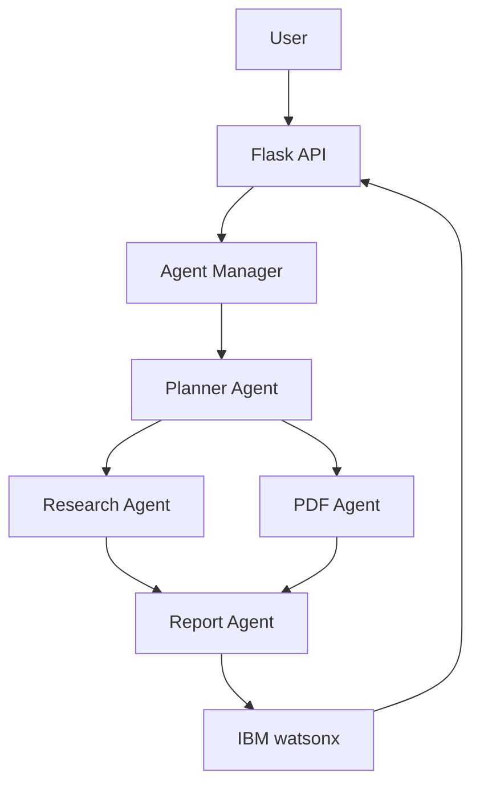

# ResearchX AI

ResearchX AI is an AI-powered research assistant built using **IBM watsonx AI**, **Flask**, **HTML**, **CSS**, and **JavaScript**. It helps researchers and students generate structured research reports and analyze research papers using Large Language Models (LLMs).

---

## Features

- AI Research Report Generator
- Research Paper (PDF) Analyzer
- IBM watsonx LLM Integration
- Clean and Responsive User Interface
- Download Research Reports
- Flask Backend with REST APIs
- **Multi-Agent Agentic AI Architecture**

---

## Multi-Agent Architecture

This project uses a **lightweight Multi-Agent Agentic AI** design where each component is a specialized agent with a single responsibility. The agents are orchestrated by a central **Agent Manager**.

### Architecture Flow

```
User → Flask API → Agent Manager → Planner Agent → Research Agent / PDF Agent → Report Agent → Response
```

### Architecture Diagram



### Agent Descriptions

| Agent | File | Responsibility |
|-------|------|----------------|
| **Planner Agent** | `agents/planner.py` | Decides which downstream agent handles the request (rule-based routing). |
| **Research Agent** | `agents/research_agent.py` | Generates research reports from a topic using IBM watsonx. |
| **PDF Agent** | `agents/pdf_agent.py` | Extracts text from PDFs and analyzes them using IBM watsonx. |
| **Report Agent** | `agents/report_agent.py` | Formats raw LLM output into a structured report (Title, Summary, Key Points, Conclusion). |
| **Agent Manager** | `agents/agent_manager.py` | Orchestrates the full pipeline: Planner → Agent → Report Agent. |

---

## Tech Stack

### Frontend
- HTML5
- CSS3
- JavaScript

### Backend
- Flask (Python)

### AI Model
- IBM watsonx AI
- Llama 3.3 70B Instruct

### Libraries
- ibm-watsonx-ai
- PyMuPDF
- python-docx
- reportlab
- python-dotenv

---

## Project Structure

```
ResearchX-AI/
│
├── app.py                        # Flask entry point (routes through Agent Manager)
├── config.py                     # Environment variable loader
├── requirements.txt
├── .env                          # IBM watsonx credentials (not committed)
│
├── agents/                       # Multi-Agent AI components
│   ├── __init__.py
│   ├── planner.py                # Planner Agent — request routing
│   ├── research_agent.py         # Research Agent — topic → report
│   ├── pdf_agent.py              # PDF Agent — PDF → analysis
│   ├── report_agent.py           # Report Agent — formatting
│   └── agent_manager.py          # Orchestrator
│
├── services/                     # Core service layer (reused by agents)
│   ├── watsonx.py                # IBM watsonx LLM wrapper
│   └── pdf_service.py            # PDF text extraction (PyMuPDF)
│
├── static/
│   ├── css/
│   ├── js/
│   └── images/
│
├── templates/
│   └── index.html
│
├── uploads/                      # Uploaded PDFs (auto-created)
├── reports/
└── README.md
```

---

## Installation

Clone the repository

```bash
git clone https://github.com/prachijain-1901/ResearchX-AI.git
```

Go to project directory

```bash
cd ResearchX-AI
```

Install dependencies

```bash
pip install -r requirements.txt
```

Create a `.env` file

```env
IBM_API_KEY=YOUR_API_KEY
IBM_PROJECT_ID=YOUR_PROJECT_ID
IBM_URL=https://au-syd.ml.cloud.ibm.com
IBM_MODEL_ID=meta-llama/llama-3-3-70b-instruct
```

Run the application

```bash
python app.py
```

Open in browser

```
http://127.0.0.1:5000
```

---

## Usage

### Generate Research

1. Enter a research topic.
2. Click **Generate Research**.
3. Receive a detailed AI-generated research report.

### Analyze PDF

1. Upload a research paper in PDF format.
2. Click **Analyze PDF**.
3. View the AI-generated summary and insights.

---

## API Reference

### POST `/api/research`

Generate a research report from a text topic.

**Request Body (JSON):**
```json
{
    "topic": "Quantum Computing"
}
```

**Response:**
```json
{
    "research": "...",
    "structured_report": {
        "title": "Research Report: Quantum Computing",
        "summary": "...",
        "key_points": ["...", "..."],
        "conclusion": "...",
        "full_report": "...",
        "agent_used": "ResearchAgent"
    }
}
```

### POST `/api/analyze_pdf`

Analyze an uploaded research paper PDF.

**Request Body:** `multipart/form-data` with a `pdf` file field.

**Response:**
```json
{
    "research": "...",
    "structured_report": {
        "title": "PDF Analysis Report",
        "summary": "...",
        "key_points": ["...", "..."],
        "conclusion": "...",
        "full_report": "...",
        "agent_used": "PDFAgent"
    }
}
```

---

## Screenshots

### Home Page

_Add project screenshot here_

### AI Generated Research

_Add screenshot here_

### PDF Analysis

_Add screenshot here_

---

## Future Improvements

- Citation Generator (APA, MLA, IEEE)
- Literature Review Generation
- Research Gap Detection
- Multi-language Support
- Export to PDF and DOCX
- User Authentication
- Research Dashboard
- LLM-based Planner Agent (replace rule-based routing)
- Memory / Context sharing between agents
- Additional specialized agents (Citation Agent, Review Agent)

---

## Author

**Prachi Jain**

B.Tech Computer Science Engineering

---

## Acknowledgements

- IBM watsonx AI
- Flask
- Python
- GitHub
